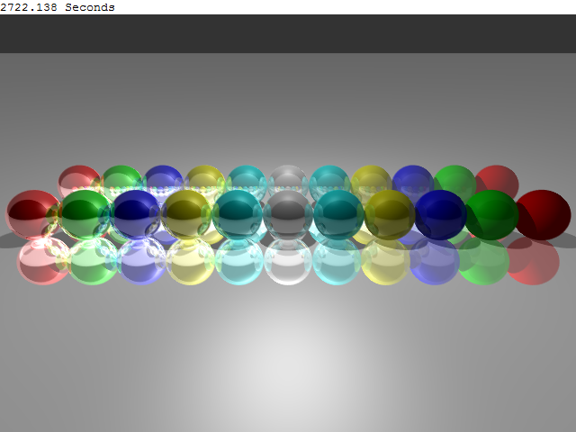

# Artifacts

## Data Structures and Algorithms
* [C++](https://github.com/jryga/C-Algorithms)  
* [Python](https://github.com/jryga/PythonAlgorithms)  

## [RaidExec](https://github.com/jryga/RaidExec)
This was my teams capstone project at Seneca College. It was conducted across three-semesters. The original repo was created by our professor and has since been deleted. So I made this repo. Some of the packages and SQL settings might be outdated depending on your visual studios.

## [Gaussian Blur CUDA Optimization](https://wiki.cdot.senecacollege.ca/wiki/BETTERRED)
Using an existing tool found on GitHub, CUDA optimizations were added and a performance report was created.
The goal of this project was to find and asses possible candidate programs for CUDA optimization.
My group and I chose a Gaussian Blur program as our main candidate.

## [Turing RayTracer](RayTracer)
Created back when I was in high school.  Written in Turing.
This was a long time ago, I can't remember much but I enjoyed writing it.  I wrote a lot of things with Turing outside of the classroom during highschool. 
  

  
## Critical Security Flaws Discovered at Seneca College
  * This is ongoing.  Top secret critical flaws were found, currently being reported.
  * As of January 2018 flaws have been monkey patched so I will continure to withhold.

## Propsed Degree Program Site Visit
In 2018 Seneca College proposed a new Data science degree program. I, along with several other students met with the Post-Secondary Quality Assessment Board (Ministry).  We had lunch and discussed the program proposal. 

## [Polytechnics Canada 2017 Interview](http://www.polytechnicscanada.ca/events/polytechnics-canada-annual-conference-2017-0)
Gave an interview about my job and Seneca College.  The video is not hosted anymore.

## Other works
[EarthQuakeFinder - Android app](https://github.com/jryga/EarthQuakeFinder)
[FoodItemCataloguer - iOS Swift app](https://github.com/jryga/FoodItemCataloguer)
[Typing Coach - Python](https://github.com/jryga/TypingCoach)

----
#### [Return to home](https://github.com/jryga/Portfolio#top)
